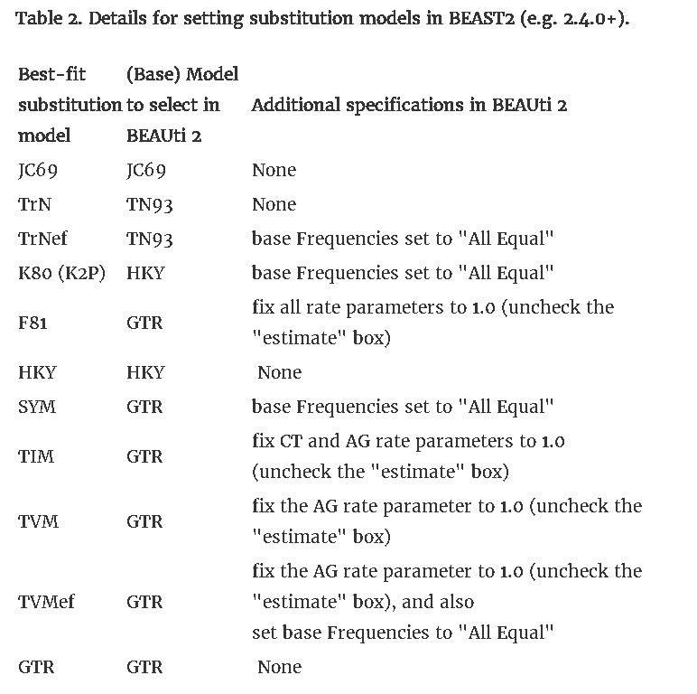

# Session 7 - Phylogenetic Analysis

## An introduction to Phylogenetics
Since the eve of Biology as a field of Science, one of the key questions has been how do the different organisms we see today relate to each other, and how they evolved. In the old days, we used anatomical similarities (also known as [homologies](https://en.wikipedia.org/wiki/Homology_(biology))) and dissimilarities to try to reconstruct their evolutionary history. 


With the dawn of genetic sequencing and the genomic era, we can now establish those relationships with quite more certainty and in a less biased way. The practice of using genetic data to infer these relationships is known as Phylogenetics, and it is the "gold-standard" for establishing the relationship between modern species. 

### The Base of Phylogenetic Analysis 
The basic idea behind it all is quite simple: as species diverge over time, they accumulate mutations that the other groups don't share. So, when comparing several sequences, the bigger the number of differences between them, the larger the time since their common ancestor. However, this simple idea gets complicated quite soon, as we are working with really long sequences and, in some cases, long periods of time. This means that we will need to use robust statistical modeling in order to infer these relationships, which we will represent as a [phylogenetic tree](https://en.wikipedia.org/wiki/Phylogenetic_tree).


*Phylogenetic tree from Ersmark et al. 2016: https://doi.org/10.3389/fevo.2016.00134*

Each tree is a hypothesis of the relationship between our sequences, and our goal is to identify (from all the possible trees), the one that is most likely to be true tree, according to our data. This may vary depending on the region you are looking at, the models you are using or how you preprocess and align your sequences. 

So, with this in our minds, let's get going... 

## Goals
+ Align our sequences from Session 6;
+ Test which substitution model works better with our data;
+ Work with IQTree and learn how to extract information from its output;
+ Create a phylogenetic tree that is meaningful for our project's question;

## Input
+ Fasta sequences of the complete **mitochondrial DNA** and **CytB** that we curated in Lab 6

## Output(s)
+ Multiple Alignment of the complete mitochondria
+ Multiple Alignment of the CytB
+ IQTree file with relevant info on out tree
+ Tree file 

## Tools
+ Alignment program: [mafft](https://mafft.cbrc.jp/alignment/software/)
+ Maximum Likelihood  program: [IQTree](http://www.iqtree.org/)
+ Bayesian Inference program: [BEAST2](https://www.beast2.org/)

## Details

For this Session, we are going to use the files that we created in the previous lab. Make sure you followed the instructions properly and that you have all the files you require at hand. 

**It's also a good idea to use the script you created in session 6 to change to one of the shorter names in your fastafile!**

### Step 1a:

The first step is to do a **Multiple Alignment**. 
As we have two different files (of quite different sizes), we recommend that you work in two terminal windows. 

We are going to run MAFFT the same way we did in Lab5, but this time we need to produce an **ordered FASTA alingment** (be careful not to mix it with your other fasta files). 

We'll do this for both **the whole mitochondria** and the **16S datasets**. 

### Step 2:

Once we have the alignment, we can proceed to inferring **which tree, of all the possible trees, is the most likely one**. 
There are several methods to do this:

+ [Parsimony](https://www.mun.ca/biology/scarr/2900_Parsimony_Analysis.htm): "**the simplest explanation that can explain the data is to be preferred**", so the hypothesis with the smallest number of changes is the most likely. 
 However, this method has plenty of assumptions that we know are false, so it is not used anymore.
+ [Neighbour-joining](https://academic.oup.com/mbe/article/4/4/406/1029664): A slightly more refined version of parsimony in which we chose the best tree by **minimizing branch lengths** in the tree. More computationally intensive than parsimony, but still something that a modern computer can do fairly quickly.
+ [Maximum Likelihood](http://ib.berkeley.edu/courses/ib200a/lect/ib200a_lect11_Will_likelihood.pdf): "Likelihood is defined to be a quantity proportional to the probability of observing the data given the model". This means that, **by providing a model of how DNA sequences change, we can determine which tree is the most probable to be true**. 
+ [Bayesian Inference](https://www.sciencemag.org/site/feature/data/1050262.pdf): This method uses Bayesian Statistics to combine **prior information** that we know about our data (also known as Prior Probability Distribution) **with the likelihood**, in order to transform it into a more accurate probability distribution, known as the **Posterior**.


*Prior, likelihood and posterior distribution for a two-parameter phylogenetic example in Nascimento et al. 2017: https://dx.doi.org/10.1038%2Fs41559-017-0280-x*

The last two are the state-of-the-art methods for phylogenetic analysis, and have become more and more popular as computing power has increased, as both methods are very demanding in that regard. 

For our project, we are going to use: 
- an implementation of the Maximum Likelihood approach called [IQ-TREE](http://www.iqtree.org/doc/Tutorial#first-running-example) 
- and one of the most popular tools for Bayesian Phylogenetic Inference, [BEAST2](https://www.beast2.org/). 

We'll start with IQ-Tree, as this software offers several methods to speed up the analysis. 

As we mentioned earlier, any Maximum Likelihood approach is **based on a model**. In phylogenetics, this model **describes the probability of each substitution to happen**. [Here](http://evomics.org/resources/substitution-models/nucleotide-substitution-models/) you can find a list of the more common models, and [here](http://www.iqtree.org/doc/Substitution-Models) the ones that are implemented in IQ-TREE. 


*Graphical representation of some substitution models from Yang & Rannala, 2012. Nature Reviews Genetics: https://doi.org/10.1038/nrg3186*

Now that we have a general picture of what we are doing, let's start working with IQ-TREE. The basic syntax for this software is:

```
iqtree -s ALIGNMENT -o OUTGROUP -m MODEL -pre OUTPUT_PREFIX -bb 1000
```
Under OUTGROUP you should put the **name of your outgroup** as they appear in the alignment file. 
If you have multiple outgroups you can separate them with a comma (**make sure to have no spaces as separators!**) eg;

```
-o c_Vurs,H_sap

```

Now run IQ-TREE in your open terminal with the CytB data, and set your model to *-m MFP*. 
- *MFP* stands for ModelFinder Plus, and is an algorithm that automatically considers a list of substitution models & estimates which model is the one that fits our data better. 
- *-bb 1000* means that we want our algorithm to use [bootstrapping](https://en.wikipedia.org/wiki/Bootstrapping_(statistics)). 

**Once the alignment of the whole mitochondrial dataset is done, run IQ-TREE on that dataset. Remember to adapt the command above to run IQ-TREE and be careful to not over-write your files. 

All the questions below **refer only to the CytB** output.

**Question 1: Which files did IQ-TREE output? Explain briefly what each of them is.** 

Now let's look at the *.iqtree* file. 

**Question 2: Which model did ModelFinder choose? From all the criteria calculated by this software, which one was used to determine the best-fitting model?**

**Question 3: Briefly explain the best-fitting model.**

**Question 4: Now look at both your Maximum Likelihood tree and Consensus Tree. Are they the same? If not, where do they differ?** 

**Question 5: In both trees you can see a number at the base of each branch. That is the number of iterations that supported that branching during bootstrapping. Which one is your least supported branch? What does that mean in relation to your question?**

### Step 3:

BEAST2 is a program for doing Bayesian phylogenetic analysis. The program uses a Markov Chain Monte Carlo (MCMC) method for exploring the parameter space in a stepwise fashion. Each new step is either accepted or rejected based on the change in likelihood. The posterior probability for each parameter is based on the frequency with which the parameter values are observed.

The first step is to **decompress** it.

`tar fxz ./SRC/BEAST.v2.6.7.Linux.tgz`

To start BEAST2 apps, type

`PATH_TO_BEAST_FOLDER/beast/bin/beast`

BEAST2 uses different GUI (Graphical User Interface) apps for the different steps, so we will need to change the name of the app accordingly.

The input files for BEAST2 are in the NEXUS or FASTA alignment format. 
You will work on your own two datasets (**in nexus format**). 
- The first step is to create an **XML file** with the settings for our BEAST run. This is done with **BEAUTi**:

`./SRC/beast/bin/beauti`

- Once the new window pops up, you have to **import the alignment file**. 
- We want to do this for **both our alignments**. You can do it from the *File/ Import Dataset* menu or by clicking in the "+" symbol in the lower left corner.
- Once you have the alignment loaded, we need to **specify the settings we are going to run BEAST with**. BEAUTi offers a lot of different options, and we can even subdivide our alignment to apply different models to different regions, estimate split times, etc.

However, as we are only interested on **reconstructing the phylogeny** of our sequences, we are going to **modify only a few of the settings**.

- The first one is the Evolution Model, which can be done through the **Site Model tab**. 
- As we are going to use the same model IQTree selected and BEAST only has a few integrated models built in (JC69, TN93, HKY and GTR), you **may need to modify one of these** to **adapt it to your actual model**. This can be done by:
a) **modifying the XML file** (explained here: https://beast.community/custom_substitution_models) 
b) **or from BEAUTi by following this table** (source: https:// justinbagley.rbind.io/2016/10/11/setting-dna-substitution-models-beast/)



If your model has some other letters, like "+I" or "+R", you can find what they mean here: http:// www.iqtree.org/doc/Substitution-Models and modify the settings accordingly.

Once we have everything set up in the Site Model, we move to the **Priors tab**, 
- select **Yule Model**, 
- as a birth rate a **Gamma distribution** 
- with an **Alpha** (shape) of **0.001** 
- and a **Beta** (scale) of **1000**.
- The last step is to go to the **MCMC tab** to specify how many steps the MCM chain will take before stopping. This should be set to, **at least, 100000**.
- Once this is done, we can save the XML file and close BEAUTi.
- Once we have our XML file, we can run BEAST2. For this session, we are **only going to run it on the cytB alignment**. 
- Once the window pops open, **select the XML file**, 
- set a **random seed** (keep seeds consistent for reproducibility) and 
- check the **"Use BEAGLE library if available"**. This last step will make your analysis faster.
- Then click on "Run" to start.

As we said earlier, you are running this for the CytB alignment. We'll be running the mitochondrial alignment and check the results for both in the next session. 

**Question 6: Which setup did you use in BEAST2?** 

**OPTIONAL**:
BEAST offers many other options and tools to be sure our estimates are appropriate that were left out from this tutorial because the fall out of our scope, but if anyone is interested, you can check the tutorials in the software webpage or this great introduction https://taming-the-beast.org/tutorials/Introduction-to-BEAST2/


# REPORT

Submit a file with the answers to all the questions and the *.iqtree* file for the CytB run.

---

This is the end of the lab, please make sure that you completed and wrote down the answers to all of the questions.
Upload the **scripts** (code) that you were asked to submit to studium **in the original format** (i.e. .py or .sh), no `pdf` or word files! Any answers that are not code should of course be in text formats such as `.pdf, .txt & .docx`.
Also, make sure to delete any files that you no longer need - you can copy them somewhere else if you want to keep them.
